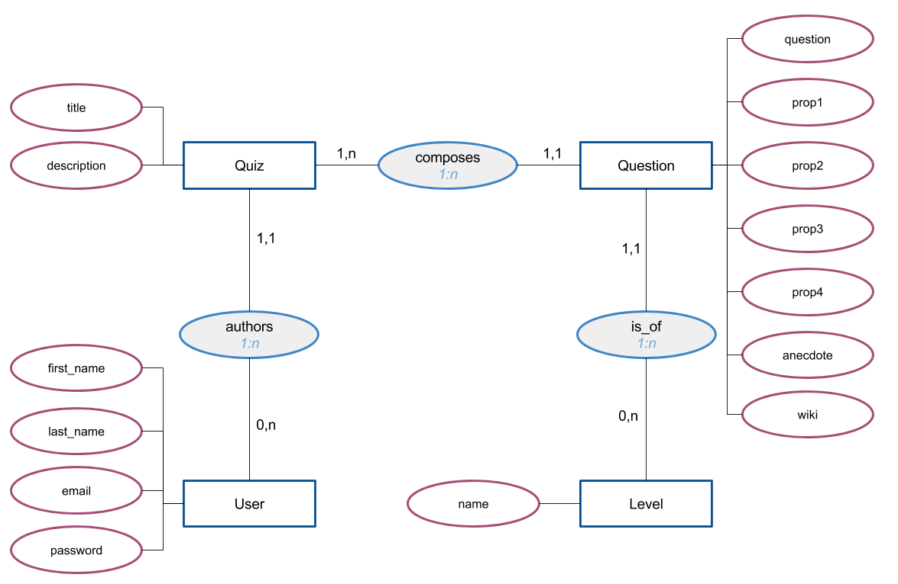

# O'Quiz
*compétences: développer une interface utilisateur, développer des composants d’accès aux données, développer des pages web en lien avec une base de données*

## Objectif
Votre ami a eu cette idée d'appli web mais n'arrive pas à la mettre en oeuvre:  
Il s'agit de permettre à ses visiteurs de consulter des quizzes sur des sujets divers, et de pouvoir y jouer en s'étant inscrit au préalable.  
Le code que vous récupérez est incomplet. Vous commencerez par le corriger, puis y ajouterez les fonctionnalités demandées... Et plus si affinités.

## Description du projet
**O'Quiz** est une application simple de quiz.  
En arrivant sur la page d'accueil, les visiteurs voient la liste des quiz.  
Ils peuvent également s'inscrire ou se connecter.  
Sur la page d'un quiz s'affichent les infos du quiz et la liste de questions.  
Les visiteurs non connectés voient seulement la liste des questions, alors que les visiteurs connectés peuvent jouer (grâce à un formulaire).  
Lorsqu'un visiteur se connecte il doit être redirigé vers sa page de profil et peut consulter les quiz qu'il a lui-même créé.  
Pour l'instant, les utilisateurs ne peuvent pas ajouter de nouveau quiz, votre ami s'est contenté d'en insérer quelques uns en base de données pour les tests.  

```
 /              home
|_  /signup/    inscription
|_  /signin/    connection
|_  /quiz/8     page d'un quiz (consulter ou jouer)
|_  /compte/    profil user (accessible seulement à l'user connecté)
```

### installation du projet
* importer dans cette BD créée dans PMA la structure (`sql/oquiz-struct.sql`) puis les données (`sql/oquiz-data.sql`).
* `composer install`
* créer le fichier de config (`application/config.php`) sur le modèle fourni


### données
* Un quizz est créé par un utilisateur, et est composé de plusieurs questions.
* Chaque question possède 4 propositions, dont une seule correcte. En base de données la réponse correcte est dans le champ `prop1` de la table `questions`.  
* Les questions sont caractérisées par un niveau de difficulté
* La base de données contient également les données relatives aux utilisateurs du site.



#### Membres
* philippe@oclock.io - quizoclock
* chuck@oclock.io - quizoclock
* elsa31@gmail.com kawazakioz
* test elsabourge@gmail.com

## Instructions
* Commencez par prendre en main le code, l'installer, le tester, le parcourir.
* Votre ami signale un bug dans le code: "quand je me connecte, il ne se passe rien. Normalement, je suis redirigé vers mon profil. Pourtant, si je clique sur l'accueil je suis bien identifié." Aidez le à corriger.
* Occupez vous de :
  1. la page d'accueil : [instructions](docs/page-accueil.md)
  2. la page de consultation d'un quiz [instructions](docs/quiz-consulter.md)
  3. le système de quiz! [instructions](docs/quiz-jeu.md)
