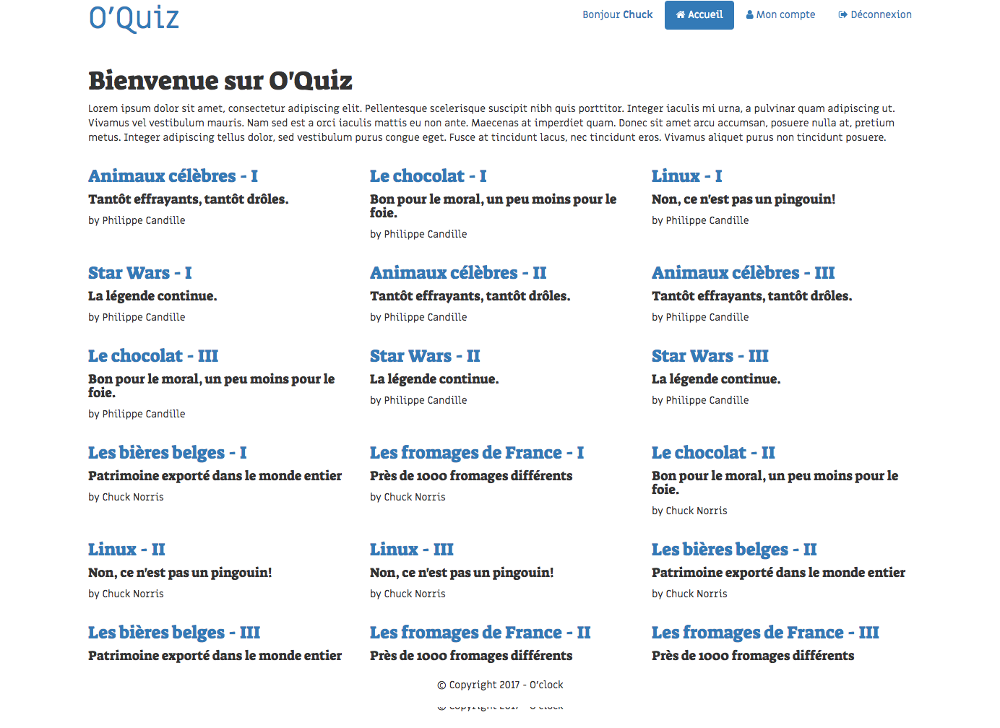

## 1. Page d'accueil
* Afficher la liste des quiz disponibles sur le site:  
  * Créer le QuizModel: quels attributs pour un quiz? méthode qui permet de récupérer tous les quizzes? génération du nom complet de l'auteur?
  * Créer la méthode de controller `indexAction`
  * Créer le template d'affichage des quizz

* Ajouter la liste des quiz d'un utilisateur à sa page "Mon Compte"
Tip: réutiliser le même template d'affichage de la  liste des quiz que sur la page d'accueil

  
