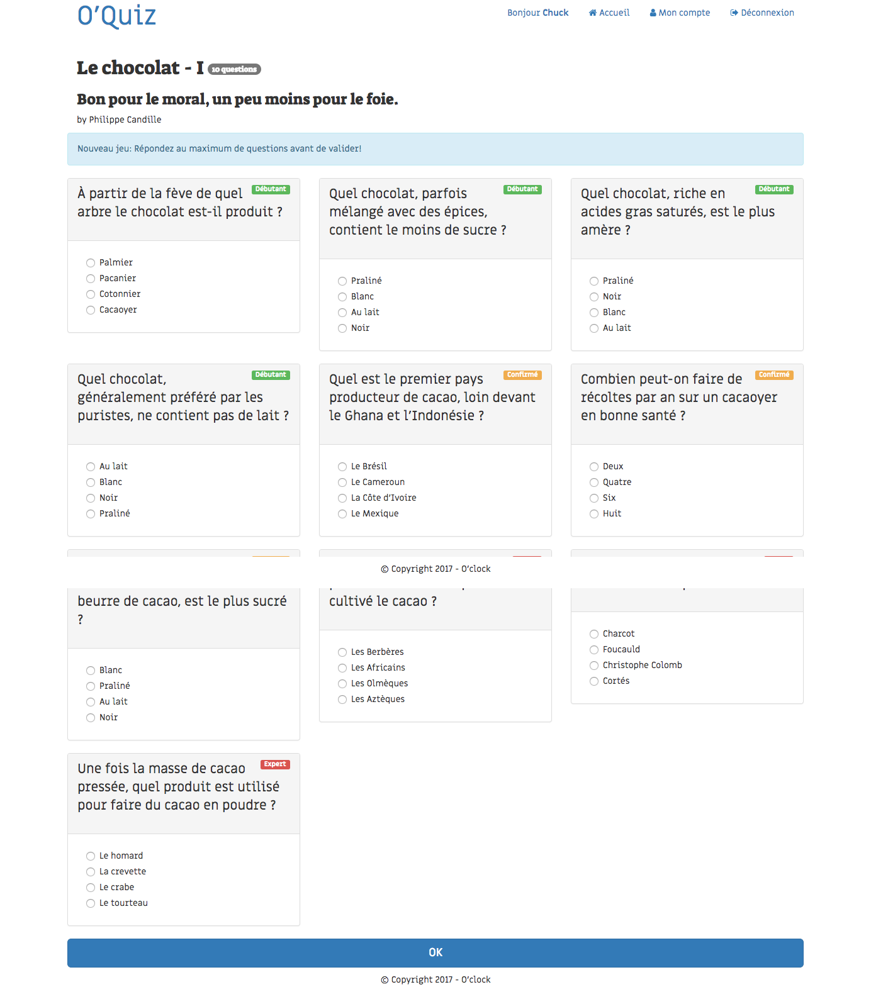
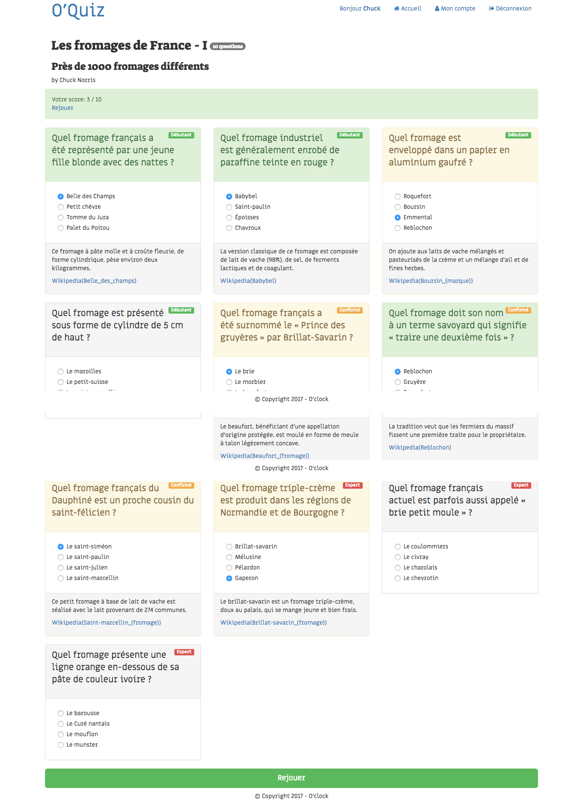

## 3. Jouer!
Les utilisateurs connectés doivent pouvoir jouer lorsqu'ils consultent un quiz.  
* la route `quiz` ne change pas, seul l'affichage de la liste de questions change si l'utilisateur est connecté:    
  * créer un nouveau partial: `list_form.php` qui affiche aussi les questions, cette fois dans un formulaire.  
  * faire en sorte que le formulaire s'affiche seulement pour les utilisateurs connectés (les visiteurs non connectés voient, eux, toujours la liste de questions vue plus haut)
  * traitement du résultat:
    * à l'affichage du résultat, il faut indiquer les réponses correctes (en vert), et distinguer les réponses fausses (en jaune), des questions non répondues (qui restent en gris).  
  Pour les questions auxquelles l'utilisateur a répondu, afficher également pour info l'anecdote et le lien wikipédia associés.  

  ##### Résultats attendus:

  ##### Début du jeu:
  

  ##### Résultats du jeu:
    
